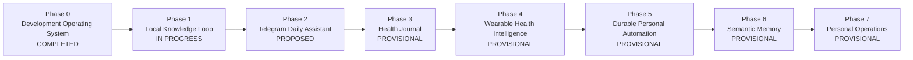

# PAIOS Roadmap

Status: Active  
Last reviewed: 2026-06-22  
Next scheduled review: 2026-07-22

This file is the authoritative source for project phases, their state, user
value, deliverables, dependencies, and exit criteria. The Mermaid diagram is a
visual projection of the phase table. If they disagree, the table wins.

## Current Position

- Current phase: **Phase 1 — Local Knowledge Loop**
- State: **in-progress**
- Current value target: capture personal knowledge locally and find it later
  with source references.
- Next candidate: **Phase 2 — Telegram Daily Assistant**
- Roadmap confidence: Phase 0 is completed and Phase 1 requirements are
  approved; Phase 2 has an agreed value boundary but still needs formal
  requirements; later phases are provisional.

## Visual Roadmap

## Phase Table

| Phase | State | User value | Main deliverables | Depends on | Exit criteria |
| --- | --- | --- | --- | --- | --- |
| **0 — Development Operating System** | `completed` | PAIOS can be developed consistently and resumed after time away. | Codex operating model; requirements/ADR/plan/session/audit structure; RED–GREEN capability evaluations; repository validation; local raw-session capture; TypeScript `./paios status`; roadmap and debt tracking; one audited delivery cycle. | None | Status CLI passes lint, typecheck, tests, build, human/JSON acceptance checks; roadmap appears in status; CI, delivery session, process audit, and phase review are committed. |
| **1 — Local Knowledge Loop** | `in-progress` | Capture personal knowledge locally and find it later with sources. | CLI and inbox capture; Markdown/text and repository-document ingestion; audio-file transcription; local durable storage; lexical/full-text search; sourced retrieval. | Phase 0 | A note, document, and audio recording can each be captured, stored, searched, and retrieved offline with source references. |
| **2 — Telegram Daily Assistant** | `proposed` | Use PAIOS naturally during daily life from Telegram. | Telegram workspace model; text, voice, and document capture; transcription; knowledge search; source-backed answers; safe command/approval boundaries. | Phase 1 | Telegram can capture supported inputs and answer from the local knowledge base with traceable sources and no silent data loss. |
| **3 — Health Journal** | `provisional` | Understand manually recorded health observations before relying on wearable APIs. | Symptoms, habits, workouts, sleep observations, manual measurements, CSV/JSON imports, sourced trend reports. | Phase 1; optionally Phase 2 | The user can record and import health data, review trends, and trace every conclusion to source records. |
| **4 — Wearable Health Intelligence** | `provisional` | Automate collection and analysis of health metrics. | Replaceable wearable adapters; normalized health model; synchronization; anomalies; trends; correlations; recommendation safeguards. | Phase 3 | At least one wearable provider synchronizes reliably through an adapter, and normalized insights remain traceable and recoverable. |
| **5 — Durable Personal Automation** | `provisional` | Run long-lived personal workflows that survive interruptions. | Scheduling; approval gates; checkpoints; retries; resumability; execution history; cancellation; failure recovery. | Phase 0; informed by real Phase 1–4 workflows | A useful multi-step workflow survives restart and recoverable failures without losing approved state or history. |
| **6 — Semantic Memory** | `provisional` | Discover related knowledge that keyword search misses. | Embeddings; semantic retrieval; entity/relationship linking; rebuildable indexes; retrieval evaluation. | Phase 1 with documented lexical-search failures | Semantic retrieval improves an approved evaluation set while source records remain authoritative and indexes remain rebuildable. |
| **7 — Personal Operations** | `provisional` | Extend PAIOS into a broader personal executive assistant. | Personal CRM; project and recurring-workflow management; dashboards; mobile interfaces; cross-domain planning. | Validated needs from earlier phases | At least one broader personal-operations workflow delivers repeatable value without weakening privacy, portability, or replaceability. |

## State Definitions

| State | Meaning |
| --- | --- |
| `provisional` | Candidate direction derived from the vision; sequencing and scope are not approved. |
| `proposed` | A concrete value boundary exists but requirements are not approved. |
| `refining` | Requirements discovery is active. |
| `approved` | Requirements and exit criteria are approved; implementation has not started. |
| `in-progress` | Approved deliverables are being implemented and verified. |
| `blocked` | Progress requires a documented decision or external condition. |
| `completed` | Exit criteria and phase audit are complete. |
| `deferred` | Intentionally postponed with a recorded reason. |

## Roadmap Rules

- Every phase must deliver standalone user value.
- Later phases may be reordered when evidence changes value or dependency
  assumptions.
- A phase cannot become `approved` without authoritative requirements and exit
  criteria.
- A phase cannot become `completed` without verification evidence and a
  roadmap/vision review.
- At most one phase may be executing (`in-progress` or `blocked`) at a time.
- Between implementation phases, the first `refining` or `approved` phase is
  the current phase.
- New scope belongs in the smallest phase that can deliver it independently.
- Technical shortcuts and deferred quality work must be recorded in
  `docs/TECH_DEBT.md`.

## Review Triggers

Review this roadmap:

- when a phase completes;
- before approving the next phase;
- after a major requirements or architecture change;
- when implementation diverges from phase deliverables;
- monthly while active, even if no phase completes.

Store dated reviews under `docs/reviews/`.
